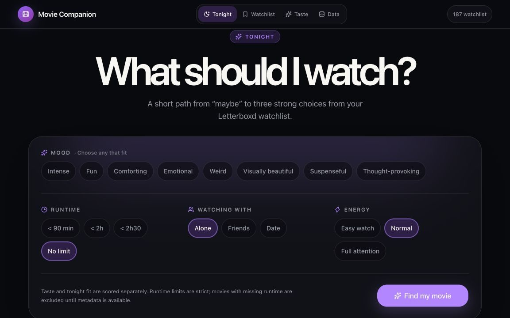

# Movie Companion

**Three personal movie picks for tonight, chosen from your Letterboxd watchlist.**

[Open Movie Companion](https://emmavellard.github.io/MovieCompanion/)

Movie Companion helps answer one question: **What should I watch tonight?**

Letterboxd remains the home for your watched films, ratings, and watchlist.
Movie Companion uses that data privately in your browser to understand your
taste and narrow your watchlist to three explainable recommendations.

## Choose for tonight

Tell Movie Companion as much or as little as you want:

- your mood, such as fun, intense, comforting, weird, or thought-provoking;
- how much time you have;
- whether you are watching alone, with friends, or on a date;
- whether you want an easy watch or something that deserves full attention.

The app returns three films from your own watchlist. Each recommendation shows
a transparent fit score and why it surfaced, separating your long-term taste
from what suits tonight. The final set is balanced so three near-duplicate
choices do not crowd out an equally strong alternative.

## Surprise me

When you do not want to choose filters, use one of three distinct modes:

- **Safe Pick** — strongly aligned with the taste signals the app knows well;
- **Risky Pick** — promising, but based on less-certain signals;
- **Wildcard** — outside your usual habits, with a meaningful connection back
  to something you tend to enjoy.

The Wildcard is designed to keep the app from turning your taste into a narrow
bubble.

## Your Taste Profile

Movie Companion turns your ratings into understandable patterns. It can show
which genres, genre combinations, directors, countries, languages, decades,
runtimes, themes, and actors you tend to rate above or below your average.

Small samples are treated cautiously, so one highly rated film does not become
a strong preference by itself.

## Get started

1. [Export your Letterboxd data](https://letterboxd.com/settings/data/).
2. Open Movie Companion and choose **Import Letterboxd ZIP**.
3. Select the ZIP you downloaded. Movie Companion finds and imports
   `ratings.csv`, `watched.csv`, and `watchlist.csv` for you.
4. Under **Data → TMDB access**, save your TMDB API Read Access Token.
5. Select **Enrich missing metadata** to add posters and movie details.
6. Return to **Tonight**, choose any preferences, and select **Find my movie**.

The setup checklist on the Tonight screen shows what is complete and what still
needs attention. You can also import individual CSV files if you prefer.

You do not need to understand the CSV columns. Movie Companion recognizes the
Letterboxd file type, validates the rows, reports what was imported, and avoids
creating duplicate movies.

If TMDB cannot confidently identify a title, open **Data → Movie metadata →
Review uncertain matches** and choose the correct movie. Ambiguous matches are
never accepted automatically.

## Which Letterboxd files do I need?

| File            | What it provides                        | Needed?  |
| --------------- | --------------------------------------- | -------- |
| `ratings.csv`   | Your ratings and personal taste signals | Yes      |
| `watchlist.csv` | The films Movie Companion may recommend | Yes      |
| `watched.csv`   | Unrated watched films and watched dates | Optional |

To update your library later, export Letterboxd again and import the latest
files. A newer file replaces the previous snapshot of that type. It does not
change anything in your Letterboxd account.

## TMDB movie details

Posters, runtimes, genres, directors, cast, languages, countries, keywords, and
other movie information come from [TMDB](https://www.themoviedb.org/).

Each person using Movie Companion supplies their own TMDB API Read Access
Token. You can create one from your [TMDB API settings](https://www.themoviedb.org/settings/api).
The token is stored only in that browser and is never saved in this GitHub
repository.

This product uses the TMDB API but is not endorsed or certified by TMDB.

## Privacy

Movie Companion has no account system, analytics, advertising, or social
features. Your Letterboxd files, ratings, watchlist, Taste Profile, and enriched
movie library are stored locally in your browser.

During metadata enrichment, your TMDB token and the title and year of the movie
being matched are sent directly to TMDB. Your ratings and watched dates are not
sent.

Local data belongs to one browser and one website address. Data imported on
`localhost`, on the published website, on another device, or in another browser
profile is separate. Clearing the website's browser data removes the local
library.

Use **Data → Backup & restore** to download a copy of your imported library and
cached movie details. You can restore that file in another browser or device.
For security, the TMDB token is not included in backups.

## Install on iPhone

1. Open [Movie Companion](https://emmavellard.github.io/MovieCompanion/) in
   Safari.
2. Tap the **Share** button.
3. Choose **Add to Home Screen**.
4. Tap **Add**.

Movie Companion will then open from your Home Screen in a standalone,
app-like view with its own purple Movie Companion icon. If you installed an
older version and still see a generic icon, remove that shortcut and add it
again so iOS refreshes the saved icon.

## Can someone else use it?

Yes. Anyone can open the same website and import their own Letterboxd data.
Their library and TMDB token remain in their own browser and do not mix with
yours. On a shared computer, use separate browser profiles to keep libraries
separate.

---

Movie Companion is an independent personal project. Letterboxd remains the
source of truth for your movie activity.
